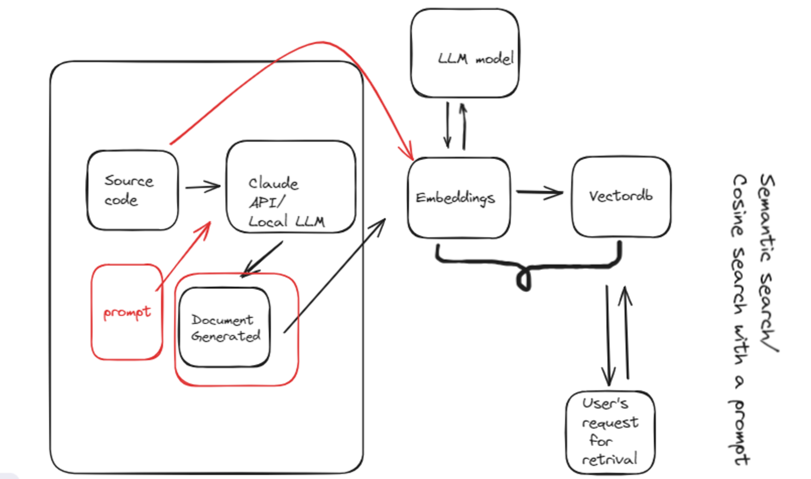

# Technical Writer Assistant

The Technical Writer Assistant is a tool that allows you to generate technical documentation for your code automatically. It uses the Anthropic API to generate the documentation based on the provided code and prompts.

## How to Use

1. Ensure you have Python and the required dependencies installed. You can install the dependencies by running the following command in your terminal or command prompt:

pip install -r requirements.txt

2. Open the `app.py` script and replace the `"sk-ant-api03-........"` API key with your own Anthropic API key.

3. Run the Streamlit app using the following command:

streamlit run app.py

4. The Streamlit app will open in your default web browser. You can enter your code in the left text area, then click the "Generate Documentation" button to generate the technical documentation.

5. The generated documentation will be displayed in the right text area. You can click the "Clear" button to clear the text areas.

## How it Works

1. The `app.py` script uses the Streamlit library to create a user interface with two text areas: one for the user to enter their code, and one to display the generated documentation.

2. When the user clicks the "Generate Documentation" button, the `app.py` script saves the user's code to the `Test_Code.txt` file.

3. The `main.py` script then reads the code from the `Test_Code.txt` file, generates the documentation using the Anthropic API, and saves the generated documentation to the `Document.txt` file.

4. The `app.py` script reads the generated documentation from the `Document.txt` file and displays it in the right text area.

5. The "Clear" button in the app clears the content of both text areas.

